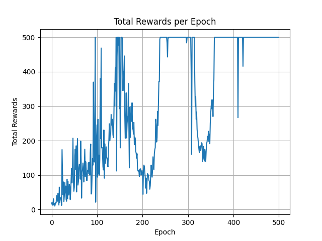

## TD1 Machine Learning 

> Victor Ludvig, fevrier 2024

#### Exercice 1

The __reinforce__ algorithm is implemented ([reinforce.py](./reinforce_cartpole.py)) and used to train a model on the  __cart-pole-v1__ environment. The model trains well and the 500 iterations threshold is reached several times throughout training. Some instabilities are observed, which are quite common with the reinforce algorithm.

#### Get familiar with Hugging Face Hub 

The __Stable-Baselines3__ library is now used to train a model on the __cart-pole-v1__ environment. See [a2c_sb3_cartpole.py](./a2c_sb3_cartpole.py).  
The model is available at the adress: [https://huggingface.co/v-l/trained_a2c/blob/main/a2c_cartpole.zip](https://huggingface.co/v-l/trained_a2c/blob/main/a2c_cartpole.zip)

#### Get familiar with Weights & Biases
Weights & Biases (W&B) is used to keep track of training metrics.  
The wandb run is available here: [https://wandb.ai/vlvl/a2c_training?workspace=user-v-l](https://wandb.ai/vlvl/a2c_training?workspace=user-v-l)

#### Full workflow with panda-gym

The __panda-gym__ library is used to train a model on the __PandaReachJointsDense-v3__ .
environment.  

Than wandb run is available here: https://wandb.ai/vlvl/a2c_training/runs/4d8jct6y?workspace=user-v-l 
The trained model is available here: https://huggingface.co/v-l/a2c_sb3_panda_reach/tree/main 

#### 